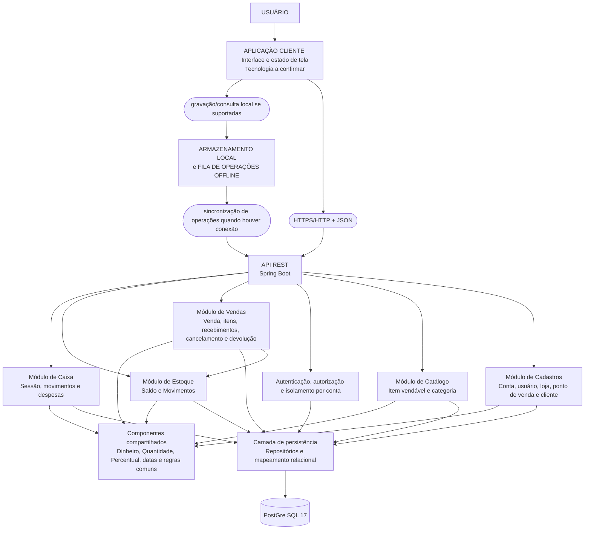

```mermaid
flowchart TD
  n0[("PostGre SQL 17")]
  n1["Componentes compartilhados<br/>Dinheiro, Quantidade, Percentual, datas e regras comuns"]
  n2["Camada de persistência<br/>Repositórios e mapeamento relacional"]
  n3["Módulo de Caixa<br/>Sessão, movimentos e despesas"]
  n4["Módulo de Estoque<br/>Saldo e Movimentos"]
  n5["Módulo de Vendas<br/>Venda, itens, recebimentos, cancelamento e devolução"]
  n6["Módulo de Catálogo<br/>Item vendável e categoria"]
  n7["Módulo de Cadastros<br/>Conta, usuário, loja, ponto de venda e cliente"]
  n8["Autenticação, autorização e isolamento por conta"]
  n9(["sincronização de operações quando houver conexão"])
  n10["ARMAZENAMENTO LOCAL<br/>e FILA DE OPERAÇÕES OFFLINE"]
  n11(["gravação/consulta local se suportadas"])
  n12(["HTTPS/HTTP + JSON"])
  n13["API REST<br/>Spring Boot"]
  n14["APLICAÇÃO CLIENTE Interface e estado de tela<br/>Tecnologia a confirmar"]
  n15["USUÁRIO"]
  n3 --> n1
  n4 --> n1
  n5 --> n1
  n6 --> n1
  n7 --> n1
  n3 --> n2
  n4 --> n2
  n5 --> n2
  n6 --> n2
  n7 --> n2
  n8 --> n2
  n2 --> n0
  n13 --> n3
  n13 --> n4
  n13 --> n5
  n13 --> n8
  n13 --> n6
  n13 --> n7
  n9 --> n13
  n10 --> n9
  n11 --> n10
  n14 --> n11
  n12 --> n13
  n14 --> n12
  n15 --> n14
  n5 --> n4
```
